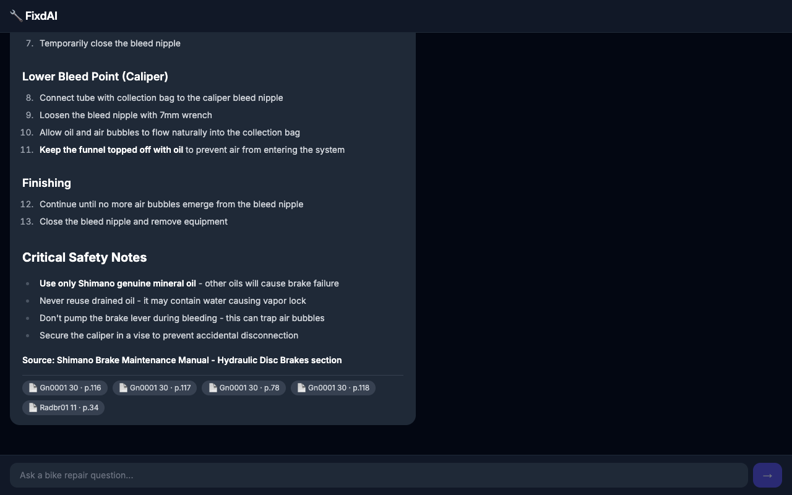

# FixdAI — RAG-Powered Bike Repair Assistant

> Ask natural language questions about bike repair and get accurate, source-cited answers powered by real Shimano dealer manuals.


---

## Demo



---

## Tech stack

| Layer | Tech |
|-------|------|
| Documents | Shimano dealer manuals (PDF) |
| Embeddings | `all-MiniLM-L6-v2` via ChromaDB (local, no API key needed) |
| Vector store | ChromaDB — persistent, zero-infra |
| Orchestration | LangChain |
| Generation | Claude (Anthropic) |
| API | FastAPI + uvicorn |
| Frontend | Next.js 14, Tailwind CSS, react-markdown |

---

## Setup

### Prerequisites

- Python 3.13 (via `uv` — see below)
- Node.js 18+
- An [Anthropic API key](https://console.anthropic.com/)

### 1. Clone and set up Python environment

```bash
git clone https://github.com/AlexDOrban/fixd.git
cd fixd

# Install uv (fast Python package manager)
curl -LsSf https://astral.sh/uv/install.sh | sh
source $HOME/.local/bin/env

# Create venv with Python 3.13 and install dependencies
uv venv .venv --python 3.13
uv pip install -r requirements.txt --python .venv/bin/python3
uv pip install cryptography --python .venv/bin/python3
```

### 2. Configure environment

```bash
cp .env.example .env
# Edit .env and set ANTHROPIC_API_KEY=sk-ant-...
```

### 3. Add Shimano dealer manuals

Download PDFs from [si.shimano.com](https://si.shimano.com) and place them in `data/docs/`. For example:

- [DM-MADBR01-06-ENG.pdf](https://si.shimano.com/en/pdfs/dm/MADBR01/DM-MADBR01-06-ENG.pdf) — MTB hydraulic disc brakes
- [DM-RADBR01-11-ENG.pdf](https://si.shimano.com/en/pdfs/dm/RADBR01/DM-RADBR01-11-ENG.pdf) — Road hydraulic disc brakes
- [DM-GN0001-30-ENG.pdf](https://si.shimano.com/en/pdfs/dm/GN0001/DM-GN0001-30-ENG.pdf) — General operations

> Note: si.shimano.com blocks automated downloads. Download manually in your browser.

### 4. Ingest documents

```bash
PYTHONPATH=src .venv/bin/python src/ingest.py --reset
```

### 5. Start the API

```bash
PYTHONPATH=src .venv/bin/python src/api.py
# Runs on http://localhost:8000
```

### 6. Start the frontend

```bash
cd frontend
npm install
npm run dev
# Opens at http://localhost:3000
```

---

## CLI usage

```bash
PYTHONPATH=src .venv/bin/python src/query.py "How do I bleed Shimano hydraulic disc brakes?"
```

---

## Architecture

```
┌─────────────────────────────────────────────────────┐
│                    FixdAI                            │
│                                                     │
│  ┌──────────┐    ┌───────────┐    ┌──────────────┐  │
│  │  PDFs /  │───▶│  Chunking │───▶│  ChromaDB    │  │
│  │  Manuals │    │  + Embed  │    │  Vector Store│  │
│  └──────────┘    └───────────┘    └──────┬───────┘  │
│                                          │          │
│  ┌──────────┐    ┌───────────┐    ┌──────▼───────┐  │
│  │  User    │───▶│  LangChain│───▶│  Retrieval   │  │
│  │  Query   │    │  Chain    │    │  + LLM Gen   │  │
│  └──────────┘    └───────────┘    └──────┬───────┘  │
│                                          │          │
│                               ┌──────────▼────────┐ │
│                               │  Cited Answer +   │ │
│                               │  Source Chunks    │ │
│                               └───────────────────┘ │
└─────────────────────────────────────────────────────┘
```

## Project structure

```
fixd/
├── data/
│   └── docs/           # PDF manuals (git-ignored)
├── src/
│   ├── ingest.py       # Document loading, chunking, embedding
│   ├── query.py        # CLI query interface
│   ├── chain.py        # LangChain RAG chain
│   ├── api.py          # FastAPI wrapper
│   └── config.py       # Shared configuration
├── frontend/           # Next.js 14 chat UI
├── screenshots/        # Demo screenshots
├── tests/
│   └── test_queries.py
├── requirements.txt
└── .env.example
```

## License

MIT
